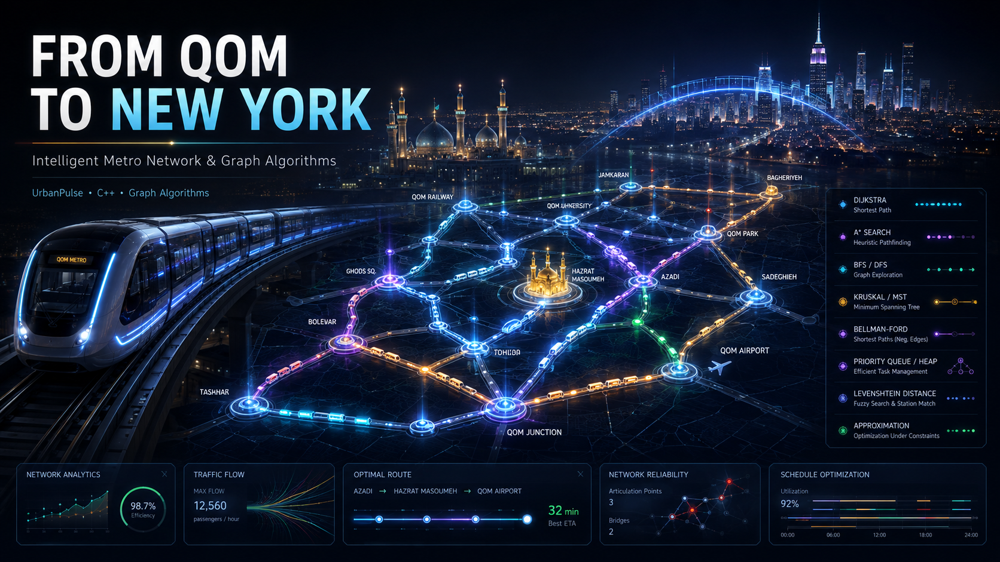
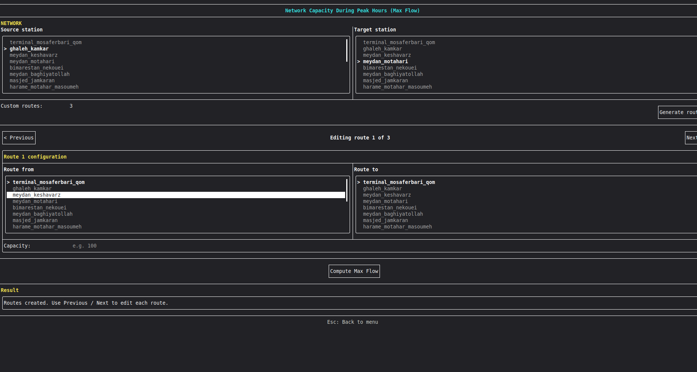
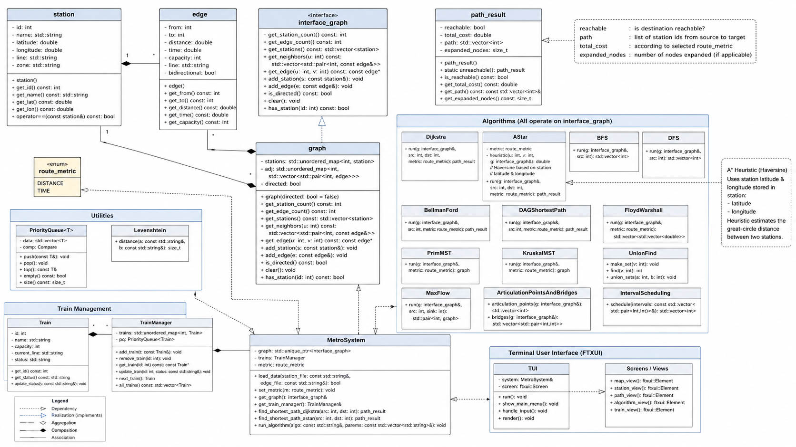

# 🚇 Qom Metro Routing System 🗺️

> A high-performance C++ metro routing engine — from Qom to New York — bringing graph theory to life with a full interactive terminal experience!

<p align="center">
  
</p>

<p align="center">
  
  
  
  
</p>

---

## 🎯 About the Project

**Qom Metro Routing System** is a complete metro-network simulation and routing engine built in modern C++. It models an entire metro network as a weighted graph and layers a rich collection of classic and advanced graph algorithms on top of it — from shortest paths and minimum spanning trees to max-flow and network resilience analysis — all wrapped in a polished terminal user interface built with FTXUI.

This project was developed as the final deliverable for an **Algorithm Design** course, and demonstrates:

- **Object-Oriented Design** built around SOLID principles, especially Dependency Inversion
- **Graph Theory in Practice** — shortest paths, MSTs, flow networks, connectivity analysis
- **Algorithm Engineering** — comparing algorithms head-to-head on the same data model
- **Terminal UI Programming** using FTXUI (interactive panels, forms, and live route visualization)
- **Clean Architecture** — a reusable core that every algorithm and UI layer builds on without touching internals


#### 🧭 Terminal UI


_The interactive FTXUI-based terminal interface, showing the main navigation menu_

---

## 🧠 Core Features

### 🗺️ Routing & Pathfinding

- **📍 Shortest Path (Dijkstra):** Fastest or shortest route between any two stations, by distance or time
- **⭐ A\* Search:** Heuristic-guided shortest path with node-expansion comparison against Dijkstra
- **🔎 Reachability Check (BFS / DFS):** Verify whether two stations are connected and trace the path
- **🌐 All-Pairs Shortest Paths (Floyd–Warshall):** Precomputed distance/time matrices for instant lookups
- **➖ Negative-Weight Routing (Bellman–Ford):** Shortest paths on graphs with negative edge weights
- **📈 DAG Shortest Path:** Optimized shortest path for directed acyclic sub-networks

### 🌳 Network Structure & Analysis

- **🌲 Minimum Spanning Tree (Kruskal & Prim):** Cheapest way to keep the whole network connected
- **🧩 Articulation Points & Bridges:** Detect critical stations and routes whose failure disconnects the network
- **💧 Maximum Flow:** Compute the maximum passenger throughput between two stations
- **🎯 Dominating Set Approximation:** Minimal set of stations covering the entire network
- **✏️ Fuzzy Station Search (Levenshtein Distance):** Find the closest-matching station name to a typo or partial input

### 🚆 Simulation & Operations

- **🚦 Platform Scheduler & Dispatch Queue:** Manage train arrivals/departures using a min-heap
- **🧍 Passenger Simulator:** Simulate passenger flow, gate queues, and average waiting times
- **📊 Network Analytics:** Track ridership and identify the busiest stations over time

### 🖥️ Terminal Interface

- **🧭 Full Interactive TUI** built with FTXUI — menus, forms, and live panels
- **🖱️ Mouse & Keyboard Navigation** with horizontal scrolling for wide route displays
- **🔀 Multi-Screen Workflows** for route finding, max flow, MST, and network analysis

---

## 🛠️ Prerequisites

Before building the project, make sure you have:

- **C++17 compatible compiler** (GCC 10+ or Clang 12+)
- **CMake 3.15 or higher**
- **Git** (FTXUI is fetched automatically via CMake `FetchContent`)
- **Linux OS** (recommended for best terminal-UI compatibility)
- **FTXUI** (an external framework for tui(will be install by cmake))


### 📦 Installing Dependencies

#### Ubuntu/Debian:

```bash
sudo apt update
sudo apt install build-essential cmake git
```

#### Arch Linux:

```bash
sudo pacman -S base-devel cmake git
```

#### Fedora:

```bash
sudo dnf install gcc-c++ cmake git
```

> ℹ️ You don't need to install FTXUI yourself — CMake's `FetchContent` downloads and builds **FTXUI v5.0.0** automatically the first time you configure the project.

---

## 🚀 Installation & Build

### 1. Clone the Repository

```bash
git clone git@github.com:aminrm4/newyork_algorithm.git
cd newyork_algorithm
```

### 2. Build the Project

```bash
mkdir build
cd build
cmake ..
make -j$(nproc)
```

### 3. Run the Application

```bash
./newyorkmetro
```

---

## 🎮 How to Use

### 🧭 Basic Controls

- **Arrow Keys:** Navigate menus, forms, and lists
- **Tab / Shift+Tab:** Move focus between fields and buttons
- **Enter:** Select an option or confirm an action
- **Mouse:** Click buttons and drag to scroll wide route views

### 🗺️ Typical Workflow

1. **Launch the app** and pick a screen from the main menu (Route Finder, Max Flow, MST, Reachability, Analytics, ...)
2. **Enter your source and destination stations** (station names, e.g. `rahahan_qom`, `pardisan`, `meydan_motahari`)
3. **Choose a metric** — distance or time — where applicable
4. **Run the algorithm** and view the resulting path, cost, or network statistics directly in the terminal

---

## 🏗️ Project Architecture

### 📁 Directory Structure

```
newyork_algorithm/
├── src/
│   ├── main.cpp                  # Entry point
│   ├── core/                     # Graph model, traversal engines, data classes
│   ├── algorithms/                # All routing, MST, flow, and analytics algorithms
│   ├── controller/                # metro_system — orchestrates core + algorithms
│   └── ui/                        # metro_tui — FTXUI-based terminal interface
├── include/
│   ├── core/                     # graph.h, interface_graph.h, station.h, edge.h, ...
│   ├── algorithms/                # dijkstra_algorithm.h, a_star_algorithm.h, ...
│   ├── controller/                # metro_system.h
│   └── ui/                        # metro_tui.h, metro_ui.h
├── tests/                        # Manual/round test files
├── pics/                         # Screenshots and diagrams for this README
├── build/                        # CMake build output (generated)
└── CMakeLists.txt                # Build configuration (FetchContent for FTXUI)
```

### 🏛️ Class Architecture

#### Core Layer (`src/core`, `include/core`)

- **`interface_graph`**: Abstract graph contract — every algorithm depends on this, never on `graph` directly (Dependency Inversion)
- **`graph`**: Adjacency-list implementation of `interface_graph`
- **`station`** / **`edge`**: Lightweight value classes for vertices and weighted connections
- **`bfs_traversal`** / **`dfs_traversal`**: Reusable, graph-agnostic traversal engines shared across multiple algorithms
- **`weighted_digraph`**: Directed-graph model used by Bellman–Ford and DAG shortest path
- **`path_result`**, **`mst_result`**, **`bellman_ford_result`**: Shared result contracts returned by algorithm classes

#### Algorithms Layer (`src/algorithms`, `include/algorithms`)

- **`bfs_algorithm`** / **`dfs_algorithm`**: Reachability and path discovery
- **`dijkstra_algorithm`** / **`a_star_algorithm`**: Shortest-path routing engines
- **`floyd_warshall_algorithm`**: All-pairs shortest paths
- **`bellman_ford_algorithm`** / **`dag_shortest_path`**: Shortest paths for special graph types
- **`kruskal_algorithm`** / **`prim_algorithm`**: Minimum spanning tree construction
- **`articulation_points_finder`**: Critical station/route detection
- **`max_flow_algorithm`**: Maximum passenger throughput computation
- **`dominating_set_approximation`**: Minimal network coverage
- **`levenshtein_search`**: Fuzzy station name matching
- **`dispatch_queue`** / **`platform_scheduler`** / **`passenger_simulator`** / **`network_analytics`**: Operational simulation and statistics

#### Controller & UI Layer

- **`metro_system`**: Central controller wiring the graph and all algorithms together
- **`metro_tui`**: FTXUI-based terminal interface consuming `metro_system`

### 📊 UML Diagram


_Class diagram showing the relationships between the core graph model, the algorithm layer, and the controller/UI layer_

---

## 🧪 Testing

Test cases live under `tests/` and are organized **by project round**, mirroring the deliverable structure of the course (`test_round3.cpp`), this file validates exactly the tasks completed in that round.

`tests/test_round3.cpp` covers Round 3 of the project:

- **T3.1 — Platform Scheduler:** validates interval-scheduling selection of non-overlapping trains
- **T3.2 — Dispatch Queue:** validates min-heap based train dispatch ordering
- **T3.3 — Passenger Simulator:** validates gate-queue processing and average waiting time
- **T3.4 — Network Analytics:** validates ridership tracking and busiest-station queries

Each test is a small, self-contained function that builds a minimal scenario (a handful of trains, stations, or passengers with known expected results), runs the relevant class, and checks the outcome with a lightweight `check(condition, test_name)` helper that prints `[PASS]` / `[FAIL]` and tallies totals — no external testing framework is required. To run them, compile the relevant test file against `qom_metro_core` (or add it as a separate executable target in `CMakeLists.txt`) and run the resulting binary; the output lists every test with its pass/fail status.

---

## 🛠️ Development

### 🔧 Building for Development

`CMakeLists.txt` uses `GLOB_RECURSE` with `CONFIGURE_DEPENDS`, so any new file added under `src/core` or `src/algorithms` is automatically picked up on the next CMake configure — no manual file-list editing required.

### 🐛 Debugging Tips

- If IntelliSense misbehaves in VS Code, reset the IntelliSense database
- Re-run `cmake ..` after adding new source files if the build system doesn't detect them
- Check the terminal output carefully — FTXUI renders directly to the terminal, so resizing your terminal window can help with layout issues

---

## 🤝 Contributing

Contributions, issues, and feature requests are welcome!

### 🐛 Reporting Bugs

- Open an issue with clear reproduction steps
- Include your compiler, OS, and CMake version

### 🔧 Development Guidelines

- Follow the existing coding style (`snake_case` naming, header/implementation separation)
- Keep algorithm classes dependent only on `interface_graph`, never on `graph` directly
- Test your changes against the existing station data before submitting

---

## 📝 License

This project is developed as an **Algorithm Design** course project for educational purposes.

---

## 👥 Collaborators

- 👤 **[Mina Zarafshan](https://github.com/MinaZarafshan)**
- 👤 **[Noora Panahi](https://github.com/NooraPanahi)**
- 👤 **[Shahriar Koulivand](https://github.com/imShahriar-klvd)**
- 👤 **[Amin Rahimi](https://github.com/aminrm4)**

---

## 🙏 Acknowledgements

- **FTXUI** for the excellent terminal UI framework
- **Our university's Algorithm Design course** for the project structure and inspiration
- **The open-source community** for tools and references

---

**🚇 Ready to find your route? Build it, run it, and start exploring the network!**

<p align="center">
  <em>Built with ❤️ >
</p>
